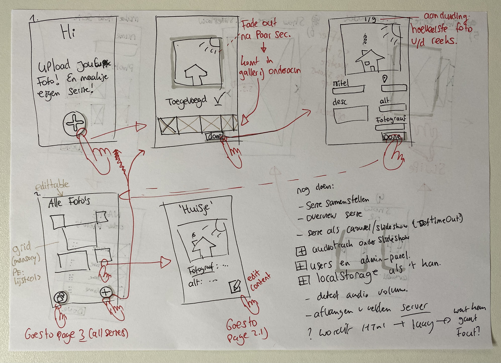
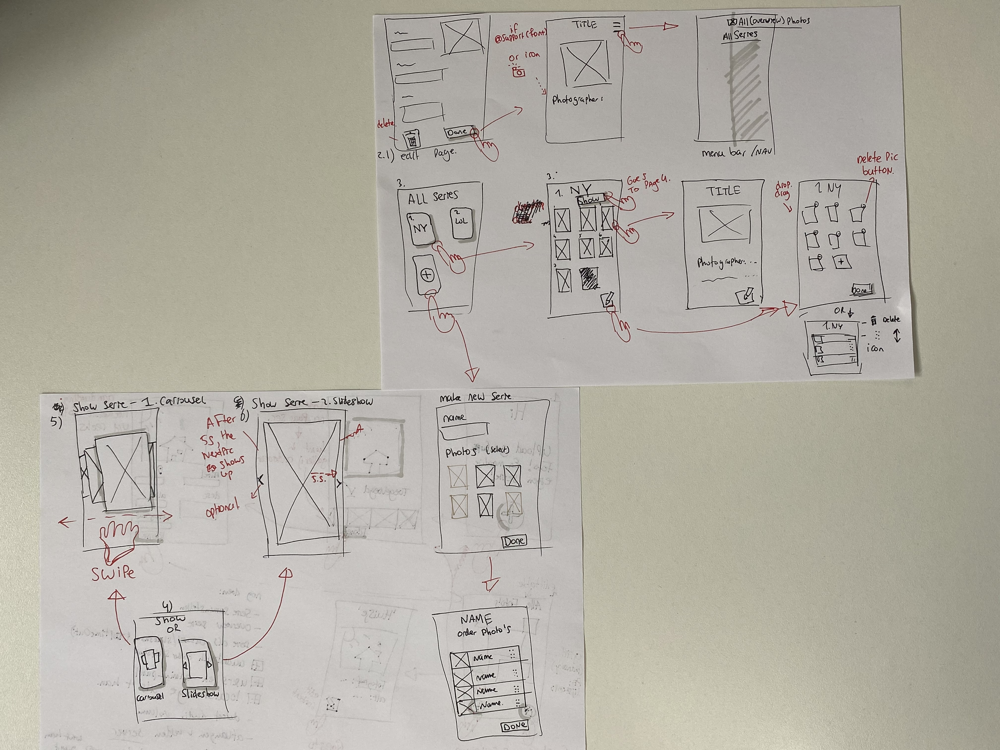

##### Browser Technologies @cmda-minor-web 2020 - 2021

  [](https://ralfz123.github.io/browser-technologies-2021) [](shields.io)

# [title project]
_Browser Technologies, a course of the minor Web Design & Development. It is a minor of the third year from the study [CMD](https://www.cmd-amsterdam.nl/)._


*** 
# Course info for me [begin]

[Rubric](https://docs.google.com/spreadsheets/d/1MV3BWwwg_Zz1n-S_qOM4iSm4gA4M6g0xAxGacyaPuac/)

# Program
<details>
    <summary>
        Opdrachten
    </summary>


het vak bestaat uit 3 opdrachten. In week 1 werken we aan opdracht 1 en 2. Vanaf week 2 werken we aan de eindopdracht.

### Opdracht 1 🛹 NPM install Progressive- enhancement

Voor de eerste opdracht gaan we onderzoeken wat Progressive Enhancement is.

- [Opdracht 1 - NPM install Progressive Enhancement](course/Opdracht1.md)

### Opdracht 2 💔 Breek het Web

Voor opdracht 2 ga je proberen het Web te laten 'breken' door (browser) features bewust uit te zetten. Wat gebeurt er als images, custom fonts, JavaScript, kleur, breedband internet niet optimaal werken? 

- [Opdracht 2 - Breek het Web](course/Opdracht2.md)

### De eindopdracht ✨ Progressive Enhanced Browser Technologie

Voor de eindopdracht ontwerp en maak je een interactieve toepassing volgens het principe van Progressive Enhancement. Zorg dat alle gebruikers, met alle browsers, in iedere context de toepassing zo goed mogelijk te zien, horen en/of voelen krijgen. De meest 'enhanced' versie is 'delightful UX', mooi en prettig om te gebruiken.

- [De eindopdracht - Progressive Enhanced Browser Technologie](course/Eindopdracht.md)

</details>


<details>
<summary>
Whole agenda
</summary>

## Planning & programma

| Planning  | Woensdag  |  Donderdag | Vrijdag  |
|---|---|---|---|
| [Week 1](#week-1)  | Intro, College + briefing opdracht 1 | Presentaties opdracht 1, college +  briefing opdracht 2 | Presentaties opdracht 2 |
| [Week 2](#week-2)  | College + Briefing De eindopdracht  | College + werken aan de opdracht | Feedbackgesprekken  |
| [Week 3](#week-3)  | College + werken aan de opdracht  |  College + werken aan de opdracht | Feedbackgesprekken  |
| [Week 4](#week-4)  | Beoordelingsgesprekken (Dinsdag en Woensdag) | Weekly Nerd | Goede vrijdag |

### Week 1

Het web is voor iedereen: Deze week gaan we onderzoeken wat Progressive Enhancement is en kennismaken met testen ~~en het device lab~~.

#### Woensdag 10 maart

Browser Technolgies begint op woensdag. In het eerste college krijg je uitleg over het programma en over het nut van Progressive Enancement. Wat is dat eigenlijk? De meeste CMD studenten hebben dit waarschijnlijk al eens gehoord en misschien iets mee gedaan in blok Tech. Progressive Enhancement, oftewel PE, is een manier hoe je je de code van een website kan bouwen zodat alle gebruikers met alle browsers je website zo goed mogelijk te zien krijgen. Met PE kun je robuuste websites bouwen die het altijd doen. PE is een manier van denken.

| Woensdag 10/3 | Wat  |
|---|---|
| 9:30 | College les 1 over het vak, wie, wat, waar en PE  |
|  | [Briefing Opdracht 1 🛹 NPM install Progressive-Enhancement](course/Opdracht1.md) |
| 16:00 | Checkout per team |

##### Lezen voor les 1 📖

- [Everyone has JavaScript, right? by Stuart Langridge](https://kryogenix.org/code/browser/everyonehasjs.html)


#### Donderdag 11 maart

Donderdag gaan we in je Squad opdracht 1 bekijken en bespreken. Als het goed is heb je een beeld gevormd van Progressive Enhancement. Tijdens de bespreking kun je ook vragen te stellen, samen onderzoeken we wat PE is, waarom het goed is om te begrijpen en misschien kunnen we al wat voorbeelden bespreken hoe je het zou kunnen toepassen.

In het college krijg je uitleg over opdracht 2. Voor deze opdracht ga je proberen het web te laten 'breken' door (browser) features bewust uit te zetten. Wat gebeurt er als images, custom fonts, JavaScript, kleur, breedband internet niet optimaal werken?

🤟 Vandaag geeft [Aaron Gustafson](https://www.aaron-gustafson.com) een gast-college. hij schreef in 2008 het artikel [Understanding Progressive Enhancement](https://alistapart.com/article/understandingprogressiveenhancement/) waarna deze manier van denken een belangrijk onderdeel werd van Web Development. Aaron Gustafson werkt bij Microsoft als 'web standard advocate' met het Edge browser team.

| Donderdag 11/3 | Wat  |
|---|---|
| 9:30 | Opdracht 1 bespreken in Squads 🛹 |
| 10:30 | College les 2 over Browser features |
|  | [Briefing Opdracht 2 💔 Breek het web](course/Opdracht2.md) |
| 16:00 | Checkout per team |
| 18:00 | Gastcollege Aaron Gustafson 🤟 |

Lezen voor les 2 📖

- [The unreasonable effectiveness of simple HTML by Terence Eden](https://shkspr.mobi/blog/2021/01/the-unreasonable-effectiveness-of-simple-html/)

#### Vrijdag 12 maart

Vrijdag bespreken we in clubjes opdracht 2. Zorg dat je de bevindingen van je onderzoek online kan presenteren. We gaan de hele feature lijst doorlopen en alle studenten kunnen laten zien wat ze hebben onderzocht, met voorbeelden, de problemen, cijfers en/of meningen. Bedenk ook hoe je de problemen zou kunnen oplossen.

| Vrijdag 12/3 | Wat  |
|---|---|
| 11:30 | Opdracht 2 bespreken in clubje A 💔 |
| 13:00 | Opdracht 2 bespreken in clubje B 💔 |
| 14:30 | Opdracht 2 bespreken in clubje C 💔 |
| 16:00 | Work Hard Play Hard |

### Week 2

In week 2 beginnen we met de eindopdracht. We hebben in week 1 onderzocht wat PE is en welke feautures wel of niet goed worden ondersteund. Deze week gaan we leren hoe je een interactieve toepassing in 3 lagen kan ontwerpen en wat je kan doen als een browser een 'enhancement' niet kan tonen.

#### Woensdag 17 maart

Woensdag krijg je een briefing van de eindopdracht en een college over browsers, en alles (!) wat daarbij hoort. Daarna gaan we aan de slag: als je een interactieve toepassing ontwerpt die alle gebruikers, met alle browsers moeten kunnen zien, dan zul je moeten bedenken hoe je de toepassing in 3 lagen kan opbouwen, eerst bepaal je de core functionaliteit en de user-delight ... schetsen maar!

| Woensdag 17/3 | Wat  |
|---|---|
| 9:30 | College les 3 over browsers, browser detect, support detection en web views |
|  | [Briefing eindopdracht ✨ Progressive Enhanced Browser Technologie](course/Eindopdracht.md) |
| 10:30 | Sessies: User Deligt & Core functionaliteit ✨ |
| 16:00 | Checkout per team |

#### Donderdag 18 maart

Donderdag gaan we voorbeelden van PE en feature detection bespreken in een college over form validatie. Daarna aan de slag met je ontwerp, in clubjes gaan we je ontwerpideeën bespreken en bedenken hoe je dit in 3 lagen zou kunnen bouwen.  

🤟 Vandaag geeft [Heydon Pickering](https://heydonworks.com) een gastcollege om 14:00. Heydon Pickering is een web developer, hij geeft lezingen en schrijft over toegankelijkeid en web design o.a. voor [Smashing Magazin](https://www.smashingmagazine.com/author/heydon-pickering/). Vorige week heb je een metafoor voor PE bedacht naar aanleiding van een filmpje van Hedon Pickering zelf. Hij komt vandaag langs! Wat wil je hem vragen over het web?

| Donderdag 18/3 | Wat  |
|---|---|
| 9:30 | College les 4 over form-validatie |
| 10:30 | Sessies: Bouwen in 3 lagen ✨ |
| 14:00 | Q&A Heydon Pickering 🤟 |
| 16:00 | Checkout per team |

Lezen voor les 4 📖

- [Be progressive by Jeremy Keith](https://adactio.com/journal/7706)

#### Vrijdag 19 maart

Vrijdag bespreken we in clubjes de vorderingen voor de eindopdracht. Zorg dat je vandaag weet welke browsers (en devices) jij gaat testen.

| Vrijdag 19/3 | Wat  |
|---|---|
| 11:30 | Vorderingen bespreken in clubje C ✨ |
| 13:00 | Vorderingen bespreken in clubje A ✨ |
| 14:30 | Vorderingen bespreken in clubje B ✨ |
| 16:00 | Work Hard Play Hard |

### Week 3

Deze week werken we verder werken aan de eindopdracht en houden we gesprekken om jullie vorderingen te bespreken en vragen te beantwoorden.

#### Woensdag 24 maart

| Woensdag 24/3 | Wat  |
|---|---|
| 9:30 | College les 5 over Viewports |
| 10:30 | Sessies: Feature detectie en testen ✨ |
| 16:00 | Checkout per team |

#### Donderdag 25 maart

Donderdag gaan we verder werken aan de opdracht en doen we code-review sessies.

🤟 Vandaag geeft Ischa Gast een presentatie.

| Donderdag 25/3 | Wat  |
|---|---|
| 9:30 | Gastcollege Ischa Gast 🤟 |
| 10:30 | Sessies: Code-reviews ✨ |
| 16:00 | Checkout per team |

Lezen voor les 6 📖

- [A minimum viable experience makes for a resilient, inclusive website or app](https://piccalil.li/blog/a-minimum-viable-experience-makes-for-a-resilient-inclusive-website-or-app)

#### Vrijdag 26 maart

Vrijdag bespreken we in clubjes de vorderingen voor de eindopdracht. Zorg dat je een code-review hebt gekregen van twee mede-studenten.

| Vrijdag 26/3 | Wat  |
|---|---|
| 11:30 | Vorderingen bespreken in clubje B ✨ |
| 13:00 | Vorderingen bespreken in clubje C ✨ |
| 14:30 | Vorderingen bespreken in clubje A ✨ |
| 16:00 | Work Hard Play Hard |

### Week 4

In week 4 wordt de eindopdracht beoordeeld. Dan gaan we je werk bekijken, bespreken en beoordelen.

| Dinsdag 30/3 | Wat  |
|---|---|
| 9:30 - 15:30 | Beoordelingsgesprekken ✨ |

| Woensdag 31/3 | Wat  |
|---|---|
| 9:30 - 15:30 | Beoordelingsgesprekken ✨ |

| Donderdag 1/4 | Wat  |
|---|---|
| 14:00 | [Weekly Nerd 2️⃣](https://github.com/cmda-minor-web/weekly-nerd-2021)|
</details>

### Leerdoelen
- _je leert wat Progressive enhancement is en hoe je dit kan toepassen._
- _je leert Browser Technologies te onderzoeken, testen en implementeren als enhancement._
- _je leert hoe je Feature Detection doet en wat je kan doen als een 'feature' niet werkt of wordt ondersteund._


# Course info for me [end]
***

[Link to live version :rocket:](https://ralfz123.github.io/browser-technologies-2021)
### Table of Contents
<table style="margin-left: auto; margin-right: auto;">
    <tr>
        <td align="center"><a href="#rocket-purpose-of-project">🚀 Purpose of Project<a></td>
        <td align="center"><a href="#heart_eyes-concept">😍 Concept<a></td>
        <td align="center"><a href="#1234-data">🔢 Data<a></td>
        <td align="center"><a href="#nerd_face-technical-summary">🤓  Technical summary<a></td>
        <td align="center"><a href="#gear-installation">⚙️ Installation<a></td>
        <td align="center"><a href="#file_folder-sources">📁 Sources<a></td>
        <td align="center"><a href="#cop-license">👮 License<a></td>
    </tr> 
</table>

## :rocket: Purpose of Project
//Robuuste, toegankelijke websites ontwerpen en maken …

Één van de mooiste [principes](https://www.w3.org/DesignIssues/Principles.html) van het web is dat iedereen met een computer en een browser het web kan gebruik. [Het web is voor iedereen](https://www.youtube.com/watch?v=UMNFehJIi0E). Het is geen gecontroleerde (programmeer) omgeving, je kan er gerust van uit gaan dat niemand precies hetzelfde te zien krijgt als wat jij in je browser ziet. Er zijn technische beperkingen, zoals afmetingen van de browser, grootte van het apparaat, manier van interactie, kwaliteit van de hardware, kwaliteit van het netwerk en er zijn mensen, allemaal verschillende mensen ...

In het vak Browser Technologies gaan we onderzoeken wat Progressive Enhancement is en hoe je dit kan toepassen om goede, robuuste, toegankelijke websites te maken. Voor iedereen. Het web is voor iedereen, in dit vak leer je hoe je daarvoor kan zorgen.


## Assigment 1
Research to Progressive Enhancement  
[&rarr; Live link :rocket:](https://ralfz123.github.io/browser-technologies-2021/assignments/assignment-1/index.html)  
[&rarr; More info ](https://github.com/ralfz123/browser-technologies-2021/blob/master/assignments/assignment-1/README.md#opdracht-1--npm-install-progressive--enhancement)   

## Assigment 2
Research about features from websites on the web
[&rarr; Research link :rocket:](https://github.com/ralfz123/browser-technologies-2021/wiki)  


## :heart_eyes: Concept
Photo viewer/uploader - collage maker


- Wat als er geen JS is?
- Wat is de core functionaliteit?

#### Welke browsers:
- Chrome

### Schets



### [Live version here :red_circle:](https://ralfz123.github.io/browser-technologies-2021)


#### Features
-	Foto toevoegen aan een verzameling met meta-info zoals beschrijving, locatie, fotograaf, alt-tekst
-	Detailpagina foto 
-	Overzichtspagina alle foto's
-	Serie samenstellen (welke foto's en in welke volgorde)
-	Overzichtspagina van een serie 
-	Serie als carrousel aanbieden
-	Serie als slideshow aanbieden

## :1234: Data  
### APIs are:
1. lorem

The data variables I used, are:
#### 1. Lorem
- `id`
### Dataset structure
#### 1. Lorem

```js

{
    id: "lorem",
}
```


## :nerd_face: Technical summary
This app is built, using:
- [npm](https://www.npmjs.com/)

# Commands building
## Challenges / Inventions:


## To-Do's :pencil:
<details>
<summary>Expand</summary>

#### App:
- [x] UI is like the non-render-server-side app (WAFS)
- [ ] static favicon rendered
- [x] Added error state

#### Code:
- [x] Render data home
- [ ] Not fetch when coming back at home
- [x] Pass data via views 
- [x] Server side fetch with npm package 
- [ ] responsive css added
- [ ] Rollup (toolip / static site generator)
    - [ ] minify
- [x] Page renders data
- [x] Add fav and fav list renders fav items
- [x] Detailpage renders data
- [x] Core feature works :white_check_mark:
- [ ] Put favouritesArray in a db like MongoDB (with session)
#### Readme:

</details>


## :gear: Installation
1. Clone the repository:  
```
git clone https://github.com/ralfz123/browser-technologies-2021.git
```

2. Install dependencies   
```
npm install
```

3. To run the app   
```
npm start
```

4. Go to [localhost](http://localhost:5000/) in the browser and voilà :sparkles:
```
http://localhost:5000/
```

## :file_folder: Sources
Credits to [Koop](https://github.com/KoopReynders) && Peter Paul Koch && [Aaron Gustafson](https://github.com/aarongustafson) && [Heydon Pickering](https://github.com/Heydon) for giving interesting lectures about Browser Technologies and Progressive Enhancement and how to deal with it.

### Code sources
- Stackoverflow (n.d.). Searching for answers on dev questions - Stackoverflow. Retrieved 8 March 2021 from https://www.stackoverflow.com

- npm (n.d.). Package manager with many packages - npm. Retrieved 8 March 2021 from https://www.npmjs.com

## :cop: License
[](https://opensource.org/licenses/MIT)  
This project from [Ralf](https://github.com/ralfz123) has a [MIT © License](https://github.com/ralfz123/browser-technologies-2021/blob/main/LICENSE)
