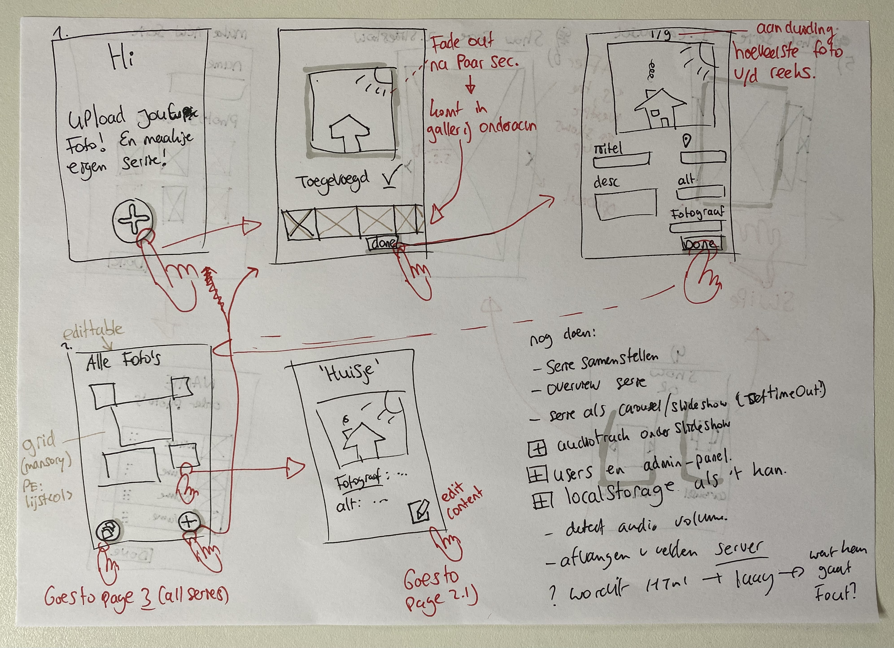
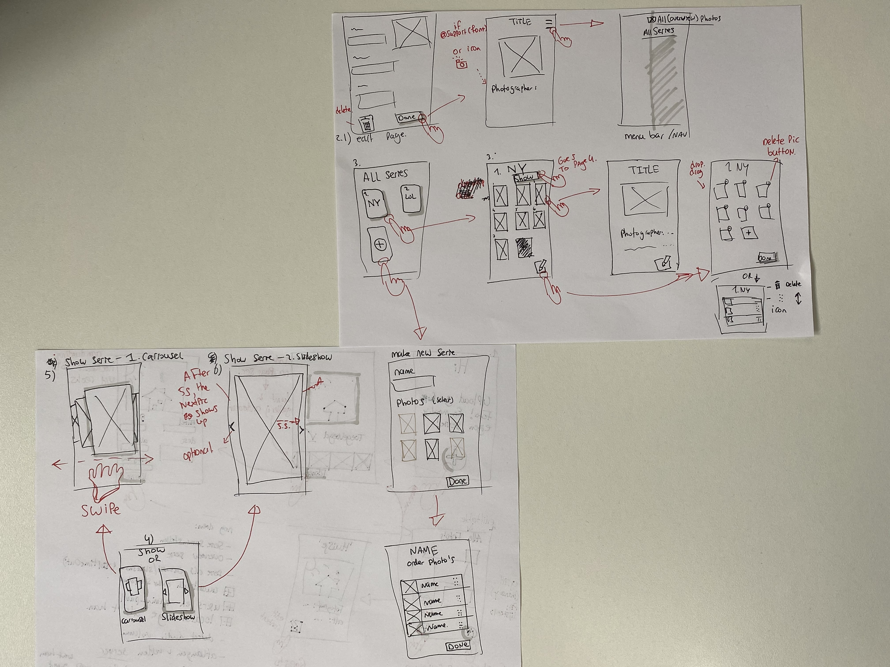

##### Browser Technologies @cmda-minor-web 2020 - 2021

  [](https://ralfz123.github.io/browser-technologies-2021) [](shields.io)

# iPic - _The online photo gallery creator_
_Browser Technologies, a course of the minor Web Design & Development. It is a minor of the third year from the study [CMD](https://www.cmd-amsterdam.nl/)._

[Link to live version :rocket:](https://ipic-bt-2021.herokuapp.com/)
### Table of Contents
<table style="margin-left: auto; margin-right: auto;">
    <tr>
        <td align="center"><a href="#rocket-purpose-of-project">🚀 Purpose of Project<a></td>
        <td align="center"><a href="#heart_eyes-concept">😍 Concept<a></td>
        <td align="center"><a href="#1234-data">🔢 Data<a></td>
        <td align="center"><a href="#nerd_face-technical-summary">🤓  Technical summary<a></td>
        <td align="center"><a href="#gear-installation">⚙️ Installation<a></td>
        <td align="center"><a href="#file_folder-sources">📁 Sources<a></td>
        <td align="center"><a href="#cop-license">👮 License<a></td>
    </tr> 
</table>

## :rocket: Purpose of Project
//Robuuste, toegankelijke websites ontwerpen en maken …

Één van de mooiste [principes](https://www.w3.org/DesignIssues/Principles.html) van het web is dat iedereen met een computer en een browser het web kan gebruik. [Het web is voor iedereen](https://www.youtube.com/watch?v=UMNFehJIi0E). Het is geen gecontroleerde (programmeer) omgeving, je kan er gerust van uit gaan dat niemand precies hetzelfde te zien krijgt als wat jij in je browser ziet. Er zijn technische beperkingen, zoals afmetingen van de browser, grootte van het apparaat, manier van interactie, kwaliteit van de hardware, kwaliteit van het netwerk en er zijn mensen, allemaal verschillende mensen ...

In het vak Browser Technologies gaan we onderzoeken wat Progressive Enhancement is en hoe je dit kan toepassen om goede, robuuste, toegankelijke websites te maken. Voor iedereen. Het web is voor iedereen, in dit vak leer je hoe je daarvoor kan zorgen.


## Assigment 1
Research to Progressive Enhancement  
[&rarr; Live link :rocket:](https://ralfz123.github.io/browser-technologies-2021/assignments/assignment-1/index.html)  
[&rarr; More info ](https://github.com/ralfz123/browser-technologies-2021/blob/master/assignments/assignment-1/README.md#opdracht-1--npm-install-progressive--enhancement)   

## Assigment 2
Research about features from websites on the web
[&rarr; Research link :rocket:](https://github.com/ralfz123/browser-technologies-2021/wiki)  


## :heart_eyes: Concept
[PE examples](https://github.com/cmda-minor-web/browser-technologies-2021/tree/master/docs/examples)
### What's it?
iPic is a online photo album where you can upload photos and it generates a photo album for you. You can make photo series from your album and you can see them in a slideshow and carousel.

#### Core feature
The user can upload/add a photo to the online album.

#### Browser technology


#### Enhancements
##### 1. Photo upload
I thought to make an enhancement so the user can directly see his uploaded image. This can be done with ... . But when there's no JS available, then filename will be shown when the file is uploaded.
https://www.youtube.com/watch?v=w1iJWS6E8lE

##### 2. [FileReader API](https://developer.mozilla.org/en-US/docs/Web/API/FileReader)
lorem
##### 3. geo loc API
lorem
##### 4. Drag & Drop
##### 5. SlideShow
1. Show in OL
2. With styling and horizontal scrolling (slide)
3. Buttons to interact with

#### Browser-testing browsers
##### iOS
- Chrome
- Safari
- (_Some non-chromium browsers?_ )
- Flow?
##### Android
- Chrome
- Firefox
- (_Some non-chromium browsers?_ )

- Results:


### Wireflow - Best Enhanced way



#### List with layers
Here is a list of the pages how they can be build by HTML, CSS and JS.


### Features
-	Foto toevoegen aan een verzameling met meta-info zoals beschrijving, locatie, fotograaf, alt-tekst
-	Detailpagina foto 
-	Overzichtspagina alle foto's
-	Serie samenstellen (welke foto's en in welke volgorde)
-	Overzichtspagina van een serie 
-	Serie als carrousel aanbieden
-	Serie als slideshow aanbieden

### [Live version here :red_circle:](https://ipic-bt-2021.herokuapp.com/)
## :1234: Data  
### APIs are:
1. lorem

The data variables I used, are:
#### 1. Lorem
- `id`
### Dataset structure
#### 1. Lorem

```js

{
    id: "lorem",
}
```


## :nerd_face: Technical summary
This app is built, using:
- [npm](https://www.npmjs.com/)
- Nodejs
- Express
- Ejs
- MongoDB

## Challenges / Inventions:


## To-Do's :pencil:
<details>
<summary>Expand</summary>

#### App
- [ ] Edit photo --> clientside JS makes form inputs not-disabled (by default disabled)
- [ ] Delete photo

#### Code
- [x] Core feature works
- [x] Connection mongoDB
- [x] multer
- pages render data
    - [x] upload
    - [x] photo overview
    - [x] photo detail
    - [x] series overview
    - [x] series detail
    - [ ] show
        - [ ] carousel
        - [ ] slideshow
- [ ] slideshow
- [ ] order page 3.4 html tags
- [ ] WEB API
- [ ] Fancy menu (clientside JS)
- [ ] Custom fonts?

### Readme
- [ ] Enhancements / Web API's?
- [ ] Test results

#### Backlog 
- [ ] Login, so each user has own pics

</details>


## :gear: Installation
1. Clone the repository:  
```
git clone https://github.com/ralfz123/browser-technologies-2021.git
```

2. Install dependencies   
```
npm install
```

3. To run the app   
```
npm start
```

4. Go to [localhost](http://localhost:5000/) in the browser and voilà :sparkles:
```
http://localhost:5000/
```

## :file_folder: Sources
Credits to [Koop](https://github.com/KoopReynders) && [Peter Paul Koch](https://www.quirksmode.org/about/) && [Aaron Gustafson](https://github.com/aarongustafson) && [Heydon Pickering](https://github.com/Heydon) && [Ischa Gast](https://ischagast.nl/)for giving interesting lectures about Browser Technologies and Progressive Enhancement and how to deal with it.

### Code sources
- Stackoverflow (n.d.). Searching for answers on dev questions - Stackoverflow. Retrieved 8 March 2021 from https://www.stackoverflow.com

- npm (n.d.). Package manager with many packages - npm. Retrieved 8 March 2021 from https://www.npmjs.com

## :cop: License
[](https://opensource.org/licenses/MIT)  
This project from [Ralf](https://github.com/ralfz123) has a [MIT © License](https://github.com/ralfz123/browser-technologies-2021/blob/main/LICENSE)
