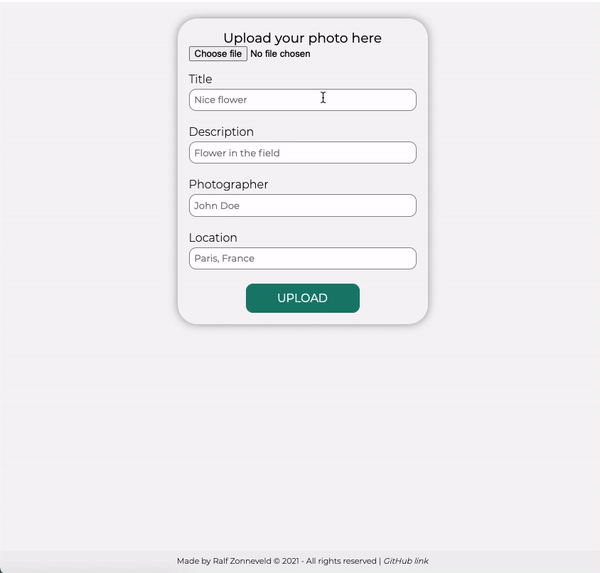
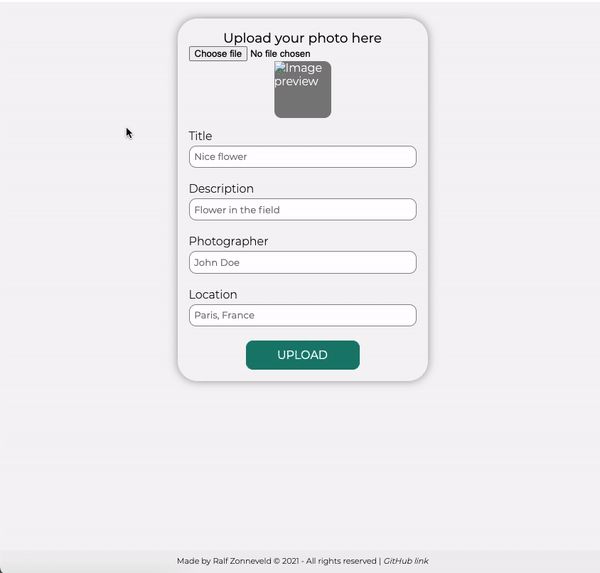
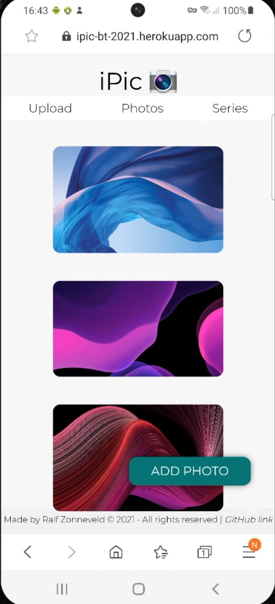
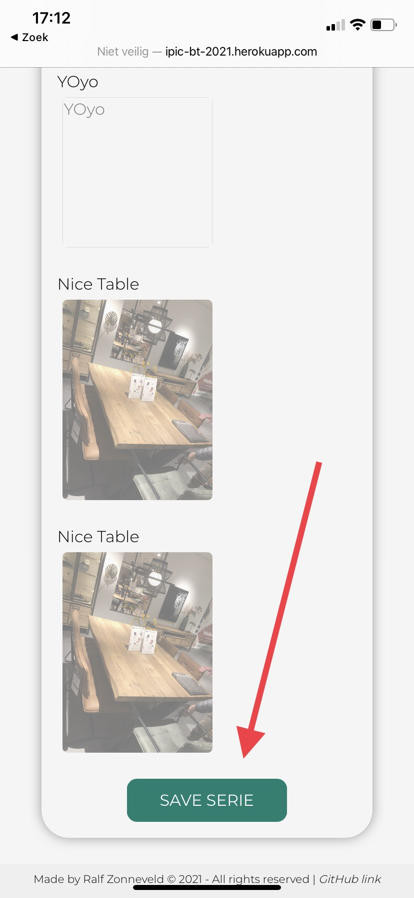

##### Browser Technologies @cmda-minor-web 2020 - 2021

  [](https://ralfz123.github.io/browser-technologies-2021) [](shields.io)

# iPic - _The online photo gallery creator_
_Browser Technologies, a course of the minor Web Design & Development. It is a minor of the third year from the study [CMD](https://www.cmd-amsterdam.nl/)._

[Link to live version :rocket:](https://ipic-bt-2021.herokuapp.com/)
### Table of Contents
<table style="margin-left: auto; margin-right: auto;">
    <tr>
        <td align="center"><a href="#rocket-purpose-of-project">🚀 Purpose of Project<a></td>
        <td align="center"><a href="#heart_eyes-concept">😍 Concept<a></td>
        <td align="center"><a href="#1234-data">🔢 Data<a></td>
        <td align="center"><a href="#nerd_face-technical-summary">🤓  Technical summary<a></td>
        <td align="center"><a href="#gear-installation">⚙️ Installation<a></td>
        <td align="center"><a href="#file_folder-sources">📁 Sources<a></td>
        <td align="center"><a href="#cop-license">👮 License<a></td>
    </tr> 
</table>

## :rocket: Purpose of Project
//Robuuste, toegankelijke websites ontwerpen en maken …

Één van de mooiste [principes](https://www.w3.org/DesignIssues/Principles.html) van het web is dat iedereen met een computer en een browser het web kan gebruik. [Het web is voor iedereen](https://www.youtube.com/watch?v=UMNFehJIi0E). Het is geen gecontroleerde (programmeer) omgeving, je kan er gerust van uit gaan dat niemand precies hetzelfde te zien krijgt als wat jij in je browser ziet. Er zijn technische beperkingen, zoals afmetingen van de browser, grootte van het apparaat, manier van interactie, kwaliteit van de hardware, kwaliteit van het netwerk en er zijn mensen, allemaal verschillende mensen ...

In het vak Browser Technologies gaan we onderzoeken wat Progressive Enhancement is en hoe je dit kan toepassen om goede, robuuste, toegankelijke websites te maken. Voor iedereen. Het web is voor iedereen, in dit vak leer je hoe je daarvoor kan zorgen.


## Assigment 1
Research to Progressive Enhancement  
[&rarr; Link to live version :rocket:](https://ralfz123.github.io/iPic-BT-2021/assignments/assignment-1/)  
[&rarr; More info ](https://github.com/ralfz123/browser-technologies-2021/blob/master/assignments/assignment-1/README.md#opdracht-1--npm-install-progressive--enhancement)   

## Assigment 2
Research about features from websites on the web
[&rarr; Research link :rocket:](https://github.com/ralfz123/browser-technologies-2021/wiki)  

From my _squad_ we gathered all researches and put it in one [wiki :rocket: ](https://github.com/sjagoori/pe/wiki).


## Assigment 3
[&rarr; Link to live version :rocket:](https://ipic-bt-2021.herokuapp.com/)
## :heart_eyes: Concept
### What's it?
**iPic** is an online photo album where you can upload photos and it generates a photo album for you. You can make photo series from your album and you can see them in a slideshow.


<!-- <details>
<summary>Happy flow</summary>

</details> -->

### Core feature
The user can upload/add photos to the online album.

### Features
**Images**  
- Add image to global online album
- Add information such as title, description, photographer and location of the image
- Check one image with his info at the detail page
- Check all images at the overview page

**Series**  
- Check all series at the overview page
- Check one serie at the detail page
- Show one serie in a slideshow
- Create new series

### Wireflow - Best Enhanced way

<details>
<summary>Part 1</summary>

</details>

<details>
<summary>Part 2</summary>

</details>

#### List with layers
Here is a list of the pages how they can be build by the layers _functional_, _usable_ and _pleasurable_.
<details>
<summary>Part 1</summary>

</details>

<details>
<summary>Part 2</summary>

</details>

## Enhancements
### 1. FileReader API
With the FileReader API, you can preview the uploaded file. In my case, you can preview the uploaded photo. That's an very enhanced way to the user of presenting the uploaded photo. But when there is no JS available, this feature will be turned off and the default `type=file` content will be presented. When the file is uploaded, you can see the uploaded file as well in string; the filename will be shown.

#### Functional  
The default `type=input` API feature shows the user the filename. Scanty, but fine.

<details>
<summary>Example</summary>
  
</details>  

#### Usable  
There is more styling and visual hierarchy. The 'Choose file' button is visually more available.

<details>
<summary>Example</summary>
  
</details>

#### Pleasurable  
There is now an `img` tag created via JavaScript, so when the user has uploaded a file, the file will be shown in the `img` tag. This is called a File Previewer.

<details>
<summary>Example</summary>
  
</details>

### 2. Slideshow
#### Functional
All photos will be shown in from top to bottom. It's usable and you can see the photos too. 

<details>
<summary>Example</summary>
  
</details>  

#### Usable
All photos are placed in a nice container where you can scroll horizontal through the photos. Altough the styling makes it easier to use. It's a nice way of viewing the photos.

<details>
<summary>Example</summary>
  
</details>

#### Pleasurable
Now there are buttons, created with clientside javascript. With these buttons you can interact and decide if you want to see the previous or next photo.

<details>
<summary>Example</summary>
  
</details>

### 3. CSS Grid replaced by Flexbox
Although Gridbox is very popular, it's not supported at all browsers (see [here](https://caniuse.com/?search=grid)). Therefore I created an enhancement for users that use a browser that not supports CSS Grid. This is a _feature detection_ which checks if the browser supports CSS Grid. If so not, then the fallback is CSS Flexbox, because almost every browser supports Flexbox (see [here](https://caniuse.com/?search=flexbox)).

Although I used two different layout models, I made them so that they look just alike.
<details>
<summary>
  <b>Grid</b>
</summary>
  

  [Code here](https://github.com/ralfz123/iPic-BT-2021/blob/master/static/styles/main.css#L403-L419)
</details>

<details>
<summary>
  <b>Flexbox</b>
</summary>
  

  [Code here](https://github.com/ralfz123/iPic-BT-2021/blob/master/static/styles/main.css#L378-L389)
</details>

### 4. prefers-reduced-motion
@media (prefers-reduced-motion) voor beweeg-gevoelige (epilepsi)
I wanted to implement an enhancement so browsers can detect if the user prefers a reduced motion on the websites he visits. So the users don't want to be harmed with the (in my experience) cool, fancy, crazy and shaky animations. I did this with `@media (prefers-reduced-motion)`. Check the code [here](https://github.com/ralfz123/iPic-BT-2021/blob/master/static/styles/main.css#L338-L347).

## Browser-testing
Browsers I tested are:

| Device                |      Browser    
|-----------------------|:-------------:
| 1. Desktop            |  Chrome
| 2. Desktop            |  Firefox
| 3. Mobile - iOS       |  Safari
| 4. Mobile - Android   |  Internet


<!-- Requirements:
- Afbeeldingen uitzetten
- Custom fonts uitzetten
- Kleur uitzetten & kleurenblindheid instellen
- Muis/Trackpad werkt niet
- Breedband internet uitzetten
- √ Javascript (volledig)
- √ Cookies niet accepteren
- √ localStorage doet het niet -->


Test list:
1. Upload image
2. File preview
3. Grid layout
4. Create serie
5. Slideshow


### Test rapport
<details>
<summary>Color test</summary>

### Buttons/links
Here I check the contrast of the colors in the buttons/links.
#### Before 
**Color** - ```#008071```

**Contrast ratio** - 4:84

First, you see that WCAG AAA has failed. I'll fix that ;).


#### After
**Color** - ```#006157```
**Contrast ratio** - 7.37

Now I changed the color to slightly darker green and now the WCAG AAA is passed! Also the contrast ratio is improved.


***

</details>

<details>
<summary>1. Upload image</summary>

### Desktop - Chrome


### Desktop - Firefox


### iOS Mobile - Safari
The upload is fine and the Safari default input behavior works fine too. This default behavior means here that the UI is zoomed in on the focussed input and you can tab through the inputs using the arrows at the left top of the keyboard. However is the input height styling from Safari and not from the linked style sheets, but it's not disturbing the UX so it's okay.


### Android Mobile - Internet
Looks a bit different from the iOS device, but works excellent.


***

</details>

<details>
<summary>2. File preview</summary>


### Desktop - Chrome
Without JavaScript you see the uploaded file name (default browser feature for the `type=file` input):  


With JavaScript you see the whole implemented feature of the application:  


### Desktop - Firefox
Without JavaScript you see the uploaded file name (default browser feature for the `type=file` input):  


With JavaScript you see the whole implemented feature of the application:  


### Mobile iOS - Safari
Safari makes his own file preview. That's nice for the user who uses this browser or computer that don't supports JavaScript:  


When you turn on JavaScript, the default Safari filepreview remains standing, but the implemented feature of the application comes next to it:  


### Mobile Android - Internet
Without JavaScript you see the uploaded file name (default browser feature for the `type=file` input):  


With JavaScript you see the whole implemented feature of the application:  


***

</details>

<details>
<summary>3. Grid layout</summary>

### Desktop - Chrome


### Desktop - Firefox


### Mobile iOS - Safari
It has a nice 1-column view, so it's nice for the mobile user.  


### Mobile Android - Internet



***

</details>

<details>
<summary>4. Create serie</summary>

### Desktop - Chrome
Creating a serie goes fine, but the user needs to scroll down for see each image. That's a bad UX. I want to see all images in one overview. 


### Desktop - Firefox


#### Issue solved :fire:
I have addressed the problem and changed the layout to a grid layout. In this way it is much easier for the user to select the images.


### Mobile iOS - Safari
It works fine, but it has the same problem as on desktop; the too long list with images. On mobile however it's harder to use it, so it definitely has to change. Also because you have to scroll all the way down to click the submit button.




### Mobile Android - Firefox


#### Issue solved :fire:
I have addressed the problem and changed the layout to a grid layout. In this way it is much easier for the user to select the images.


***

</details>


<details>
<summary>5. Slideshow</summary>

For all 4 browsers is this the result/experience of the three layers:    

**Functional** - _When CSS & JS are turned off_  
It works fine, although the images are very big.

**Usable** - _When CSS is turned off_  
It looks a lot better now that the design has been applied. It also works a lot better right away, because you can scroll horizontally through the images.

**Pleasurable** - _Fully enhanced way :sprinkles:_  
This works fantastic, because you can go to the next or previous image by using the buttons.

### Desktop - Chrome


### Desktop - Firefox
The styling of the scrollbar is from the default browser, but it's not disturbing.


### Mobile iOS - Safari


### Mobile Android - Internet


***

</details>


## :1234: Data  
I used Mongoose data schemas to create schemas before I insert the data.
### Image schema
```js
{
  image: String,
  title: String,
  description: String,
  photographer: String,
  location: String,
}
  ```
### Schema schema
```js
{
  titleSerie: String,
  images: Array,
}
  ```

## :nerd_face: Technical summary
This app is built, using:
- _Mobile First technique_
- [npm](https://www.npmjs.com/)
- [Node.js server](https://nodejs.org/)
- [Express router](https://expressjs.com/)
- [EJS Templating engine](https://ejs.co/)
- [Mongoose](https://mongoosejs.com/)
- [Heroku deployment](https://www.heroku.com/nodejs)

## Challenges / Inventions:


## To-Do's :pencil:
<details>
<summary>Expand</summary>

#### App
- [ ] Edit photo --> clientside JS makes form inputs not-disabled (by default disabled)
- [ ] Delete photo

#### Code
- [x] Core feature works
- [x] Connection mongoDB
- [x] multer
- pages render data
    - [x] upload
    - [x] photo overview
    - [x] photo detail
    - [x] series overview
    - [x] series detail
    - [ ] show
        - [ ] carousel
        - [ ] slideshow
- [ ] slideshow
- [ ] order page 3.4 html tags
- [ ] WEB API
- [ ] Fancy menu (clientside JS)
- [ ] Custom fonts?

### Readme
- [ ] Enhancements / Web API's?
- [ ] Test results

#### Backlog 
- [ ] Login, so each user has own pics
- [ ] Geo location API to detect where the user is on browser or he can pick a plot on the map
- [ ] Drag & Drop API
- [ ] "preview in full size (viewport")
</details>


## :gear: Installation
>⚠️ To use the application in development, you need a MongoDB database and a URI to connect with it! Contact me please if you want to run the project.

1. Clone the repository:  
```
git clone https://github.com/ralfz123/iPic-BT-2021.git
```

2. Install dependencies   
```
npm install
```

3. To run the app   
```
npm start
```

4. Go to [localhost](http://localhost:5000/) in the browser and voilà :sparkles:
```
http://localhost:5000/
```

## :file_folder: Sources
Credits to [Koop](https://github.com/KoopReynders) && [Peter Paul Koch](https://www.quirksmode.org/about/) && [Aaron Gustafson](https://github.com/aarongustafson) && [Heydon Pickering](https://github.com/Heydon) && [Ischa Gast](https://ischagast.nl/) for giving interesting lectures about Browser Technologies and Progressive Enhancement and how to deal with it.

### Code sources
- Stackoverflow (n.d.). Searching for answers on dev questions - Stackoverflow. Retrieved 8 March 2021 from https://www.stackoverflow.com

- npm (n.d.). Package manager with many packages - npm. Retrieved 8 March 2021 from https://www.npmjs.com

- FileReader API (n.d.). MDN. Retrieved 25 March 2021 from https://developer.mozilla.org/en-US/docs/Web/API/FileReader

- readAsDataURL (n.d.). MDN. Retrieved 25 March 2021 from https://developer.mozilla.org/en-US/docs/Web/API/FileReader/readAsDataURL

## :cop: License
[](https://opensource.org/licenses/MIT)  
This project from [Ralf](https://github.com/ralfz123) has a [MIT © License](https://github.com/ralfz123/browser-technologies-2021/blob/main/LICENSE)
